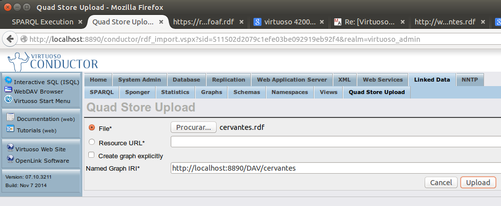

# Conversão MARC para RDF


## Conversão de UNIMARC para MARC XML

Extrato de UNIMARC:

```
600  1^aPessoa^bFernando^f1888-1935
```

Correspondente MARC XML:

```
<datafield tag="600" ind1=" " ind2="1">
        <subfield code="a">Pessoa</subfield>
        <subfield code="b">Fernando</subfield>
        <subfield code="f">1888-1935</subfield>
</datafield>
```

A conversão é feita através da script BiblioCognosis/ils-10448.js que percorre o OPAC e vai gravando registo a registo.
O resultado é BiblioCognosis/data/todos.xml, que depois é formatado em

### Dados brutos (em UNIMARC, codificados em XML)

Todos os registos bibliográficos

* BiblioCognosis/data/todos-pp.xml

Amostra dos primeiros 55 registos bibliográficos

* BiblioCognosis/data/todos-pp-1-55.xml

### Dados no modelo FRBR da IFLA

Registos bibliográficos organizados segundo o modelo FRBR da IFLA: Person, Work, Expression, Manifestation

* BiblioCognosis/marc2frbr-code/examples/marc21 simple example/records.xml

Amostra dos primeiros 55 registos bibliográficos

* BiblioCognosis/marc2frbr-code/examples/marc21 simple example/records-1-55.xml

### Regras de transformação

Documento que indica que campos do UNIMARC devem ser aproveitados; e qual o seu papel no formato FRBR

BiblioCognosis/marc2frbr-code/examples/marc21 simple example/unimarc.rules.xml

Documento gerado automaticamente a partir das regras anteriores.

BiblioCognosis/marc2frbr-code/examples/marc21 simple example/unimarc.conversion.xslt

### Dados ligados dos autores

Dados só dos autores (extraídos de BiblioCognosis/marc2frbr-code/examples/marc21 simple example/records.xml)

BiblioCognosis/marc2frbr-code/examples/marc21 simple example/autor.xml

Script de criação de dados ligados dos autores:

BiblioCognosis/xml2js2xml.js

Dados ligados dos autores:

BiblioCognosis/marc2frbr-code/examples/marc21 simple example/autor-extra.xml


## Conversão de MARC XML para Modelo relacional (FRBR)

Conversão baseada em XSLT, com base no trabalho disponibilizado no SourceForge por Trond Aalberg, http://www.ntnu.edu/employees/trondaal
svn checkout svn://svn.code.sf.net/p/marc2frbr/code/trunk marc2frbr-code


#### Múltiplas Manifestações

http://montalegre.opacnet.com/OPAC/default.aspx?ContentAreaControl=ShowRegHoldings.ascx&RegNo=587

http://montalegre.opacnet.com/OPAC/default.aspx?ContentAreaControl=ShowRegHoldings.ascx&RegNo=1172

### Resultado da conversão: FRBR em XML

#### Noção de registo

Os registo podem ter vários tipos, correspondendo às várias entidades:

Person: <record f:type="http://iflastandards.info/ns/fr/frbr/frbrer/C1005"

Obra: <record f:type="http://iflastandards.info/ns/fr/frbr/frbrer/C1001"

Expressão: <record f:type="http://iflastandards.info/ns/fr/frbr/frbrer/C1002"

Manifestação: <record f:type="http://iflastandards.info/ns/fr/frbr/frbrer/C1003"

#### Separar o documento único com os 4 tipos de registo em 4 documentos distintos

```
separa.xsl
```

### Enriquecimento do FRBR XML

Enriquecer registo a registo. Mostrar o caso dos autores.

### Conversão para RDF

Converter cada registo num recurso. Será que é preciso fazer este passo explicitamente?


Autor: José Luís Peixoto

http://datos.bne.es/autor/XX1582849.html

<?xml version="1.0" encoding="utf-8" ?>
<rdf:RDF xmlns:rdf="http://www.w3.org/1999/02/22-rdf-syntax-ns#" xmlns:rdfs="http://www.w3.org/2000/01/rdf-schema#">
<rdf:Description rdf:about="http://datos.bne.es/resource/XX1582849"><n0pred:P1002 xmlns:n0pred="http://datos.bne.es/def/">WWW Porbase, 26-12-2013</n0pred:P1002></rdf:Description>
<rdf:Description rdf:about="http://datos.bne.es/resource/XX1582849"><n0pred:OP5001 xmlns:n0pred="http://datos.bne.es/def/" rdf:resource="http://datos.bne.es/resource/XX3092077"/></rdf:Description>
<rdf:Description rdf:about="http://datos.bne.es/resource/XX1582849"><n0pred:P3067 xmlns:n0pred="http://datos.bne.es/def/" xml:lang="es">José Luís Peixoto es un narrador, poeta y dramaturgo portugués. Está licenciado en Lenguas y Literaturas Modernas (inglés y alemán) por la Universidade Nova de Lisboa. Es uno de los escritores portugueses actuales con más reconocimiento dentro y fuera de su país. Sus novelas se han publicado en un total de 20 idiomas.@es</n0pred:P3067></rdf:Description>
<rdf:Description rdf:about="http://datos.bne.es/resource/XX1582849"><n0pred:OP5001 xmlns:n0pred="http://datos.bne.es/def/" rdf:resource="http://datos.bne.es/resource/XX3365170"/></rdf:Description>
<rdf:Description rdf:about="http://datos.bne.es/resource/XX1582849"><owl:sameAs xmlns:owl="http://www.w3.org/2002/07/owl#" rdf:resource="http://dbpedia.org/resource/Jos%C3%A9_Lu%C3%ADs_Peixoto"/></rdf:Description>
<rdf:Description rdf:about="http://datos.bne.es/resource/XX1582849"><n0pred:OP5001 xmlns:n0pred="http://datos.bne.es/def/" rdf:resource="http://datos.bne.es/resource/XX4798401"/></rdf:Description>
<rdf:Description rdf:about="http://datos.bne.es/resource/XX1582849"><owl:sameAs xmlns:owl="http://www.w3.org/2002/07/owl#" rdf:resource="http://d-nb.info/gnd/157925250"/></rdf:Description>
<rdf:Description rdf:about="http://datos.bne.es/resource/XX1582849"><n0pred:P3066 xmlns:n0pred="http://datos.bne.es/def/">http://upload.wikimedia.org/wikipedia/commons/thumb/5/5b/JoseLuisPeixoto.JPG/200px-JoseLuisPeixoto.JPG</n0pred:P3066></rdf:Description>
<rdf:Description rdf:about="http://datos.bne.es/resource/XX1582849"><n0pred:P5010 xmlns:n0pred="http://datos.bne.es/def/">1974</n0pred:P5010></rdf:Description>
<rdf:Description rdf:about="http://datos.bne.es/resource/XX1582849"><owl:sameAs xmlns:owl="http://www.w3.org/2002/07/owl#" rdf:resource="http://viaf.org/viaf/87307201"/></rdf:Description>
<rdf:Description rdf:about="http://datos.bne.es/resource/XX1582849"><owl:sameAs xmlns:owl="http://www.w3.org/2002/07/owl#" rdf:resource="http://www.idref.fr/08171405X"/></rdf:Description>
<rdf:Description rdf:about="http://datos.bne.es/resource/XX1582849"><owl:sameAs xmlns:owl="http://www.w3.org/2002/07/owl#" rdf:resource="http://dbpedia.org/resource/José_Luís_Peixoto"/></rdf:Description>
<rdf:Description rdf:about="http://datos.bne.es/resource/XX1582849"><owl:sameAs xmlns:owl="http://www.w3.org/2002/07/owl#" rdf:resource="http://data.bnf.fr/14561193"/></rdf:Description>
<rdf:Description rdf:about="http://datos.bne.es/resource/XX1582849"><n0pred:P1002 xmlns:n0pred="http://datos.bne.es/def/">Nadie nos mira, 2001</n0pred:P1002></rdf:Description>
<rdf:Description rdf:about="http://datos.bne.es/resource/XX1582849"><n0pred:id xmlns:n0pred="http://datos.bne.es/def/">XX1582849</n0pred:id></rdf:Description>
<rdf:Description rdf:about="http://datos.bne.es/resource/XX1582849"><n0pred:OP5001 xmlns:n0pred="http://datos.bne.es/def/" rdf:resource="http://datos.bne.es/resource/XX4744395"/></rdf:Description>
<rdf:Description rdf:about="http://datos.bne.es/resource/XX1582849"><rdf:type rdf:resource="http://datos.bne.es/def/C1005"/></rdf:Description>
<rdf:Description rdf:about="http://datos.bne.es/resource/XX1582849"><rdfs:label>Peixoto, José Luís</rdfs:label></rdf:Description>
<rdf:Description rdf:about="http://datos.bne.es/resource/XX1582849"><owl:sameAs xmlns:owl="http://www.w3.org/2002/07/owl#" rdf:resource="http://d-nb.info/gnd/142975745"/></rdf:Description>
<rdf:Description rdf:about="http://datos.bne.es/resource/XX1582849"><owl:sameAs xmlns:owl="http://www.w3.org/2002/07/owl#" rdf:resource="http://id.loc.gov/authorities/names/no2004043312"/></rdf:Description>
<rdf:Description rdf:about="http://datos.bne.es/resource/XX1582849"><owl:sameAs xmlns:owl="http://www.w3.org/2002/07/owl#" rdf:resource="http://isni-url.oclc.nl/isni/000000012142517X"/></rdf:Description>
<rdf:Description rdf:about="http://datos.bne.es/resource/XX1582849"><n0pred:P1003 xmlns:n0pred="http://datos.bne.es/def/">(Peixoto, José Luís, 1974-)</n0pred:P1003></rdf:Description>
<rdf:Description rdf:about="http://datos.bne.es/resource/XX1582849"><owl:sameAs xmlns:owl="http://www.w3.org/2002/07/owl#" rdf:resource="http://www.idref.fr/08171405X/id"/></rdf:Description>
<rdf:Description rdf:about="http://datos.bne.es/resource/XX1582849"><n0pred:P1003 xmlns:n0pred="http://datos.bne.es/def/">port. (José Luís Peixoto) p. 4 de la cub. (n. 1974, en Galveias, Portugal)</n0pred:P1003></rdf:Description>
<rdf:Description rdf:about="http://datos.bne.es/resource/XX1582849"><n0pred:OP5001 xmlns:n0pred="http://datos.bne.es/def/" rdf:resource="http://datos.bne.es/resource/XX5144323"/></rdf:Description>
<rdf:Description rdf:about="http://datos.bne.es/resource/XX1582849"><rdfs:seeAlso rdf:resource="http://es.wikipedia.org/wiki/José_Luís_Peixoto"/></rdf:Description>
<rdf:Description rdf:about="http://datos.bne.es/resource/XX1582849"><n0pred:P5002 xmlns:n0pred="http://datos.bne.es/def/">1974-</n0pred:P5002></rdf:Description>
<rdf:Description rdf:about="http://datos.bne.es/resource/XX1582849"><n0pred:P5001 xmlns:n0pred="http://datos.bne.es/def/">Peixoto, José Luís</n0pred:P5001></rdf:Description>
</rdf:RDF>

Obra (work): Morreste-me (de José Luís Peixoto)

Duas versões (expressões) disponíveis. Mostra uma versão e remete para a outra. Cada uma destas expressões tem 1 manisfestação disponível.

Te'm morires (manifestation)
http://datos.bne.es/edicion/bimo0002157261.html
ISBN	84-96608-31-X
Com este ISBN há muitos items!

Te me moriste (manifestation)
http://datos.bne.es/edicion/bimo0002009912.html
ISBN	84-7671-797-0

Tipo de recurso: Libro

<?xml version="1.0" encoding="utf-8" ?>
<rdf:RDF xmlns:rdf="http://www.w3.org/1999/02/22-rdf-syntax-ns#" xmlns:rdfs="http://www.w3.org/2000/01/rdf-schema#">
<rdf:Description rdf:about="http://datos.bne.es/resource/XX3365170"><n0pred:id xmlns:n0pred="http://datos.bne.es/def/">XX3365170</n0pred:id></rdf:Description>
<rdf:Description rdf:about="http://datos.bne.es/resource/XX3365170"><n0pred:P1001 xmlns:n0pred="http://datos.bne.es/def/">Morreste-me</n0pred:P1001></rdf:Description>
<rdf:Description rdf:about="http://datos.bne.es/resource/XX3365170"><n0pred:OP1002 xmlns:n0pred="http://datos.bne.es/def/" rdf:resource="http://datos.bne.es/resource/XX3527759"/></rdf:Description>
<rdf:Description rdf:about="http://datos.bne.es/resource/XX3365170"><rdfs:label>Peixoto, José Luís</rdfs:label></rdf:Description>
<rdf:Description rdf:about="http://datos.bne.es/resource/XX3365170"><n0pred:P1011 xmlns:n0pred="http://datos.bne.es/def/">Peixoto, José Luís</n0pred:P1011></rdf:Description>
<rdf:Description rdf:about="http://datos.bne.es/resource/XX3365170"><rdf:type rdf:resource="http://datos.bne.es/def/C1001"/></rdf:Description>
<rdf:Description rdf:about="http://datos.bne.es/resource/XX3365170"><n0pred:OP1001 xmlns:n0pred="http://datos.bne.es/def/" rdf:resource="http://datos.bne.es/resource/XX1582849"/></rdf:Description>
<rdf:Description rdf:about="http://datos.bne.es/resource/XX3365170"><n0pred:OP1002 xmlns:n0pred="http://datos.bne.es/def/" rdf:resource="http://datos.bne.es/resource/XX3365171"/></rdf:Description>
</rdf:RDF>

## Conversão de MARX XML para RDF

### Validação do RDF

[RDF Validator](http://www.w3.org/RDF/Validator/)

### Ontologia utilizada pela BNE

Ontologia definida pela BNE: http://datos.bne.es/def/ontology.html

Exemplo de RDF gerado pela BNE: [Miguel de Cervantes](http://datos.bne.es/autor/XX1718747.ttl)

Este recurso RDF (autor) é do tipo Person. O recurso é identificado pelo URI http://datos.bne.es/resource/XX1718747

A partir do URI é devoldido um HTML, um RDF ou mesmo MARC 21. Exige software do lado do servidor que faça essa conversão a partir de uma representação interna.
Existem muitas relações entre recursos... Por isso, antes de mais, cada recurso tem que ser tratado.


```
<?xml version="1.0"?>
<rdf:RDF xmlns:rdf="http://www.w3.org/1999/02/22-rdf-syntax-ns#" xmlns:bne="http://datos.bne.es/def/" xmlns:owl="http://www.w3.org/2002/07/owl#">

<rdf:Description rdf:about="http://datos.bne.es/resource/XX1718747"><bne:id>XX1718747</bne:id></rdf:Description>
<rdf:Description rdf:about="http://datos.bne.es/resource/XX1718747"><rdf:type rdf:resource="http://datos.bne.es/def/C1005"/></rdf:Description>
<rdf:Description rdf:about="http://datos.bne.es/resource/XX1718747"><owl:sameAs rdf:resource="http://dbpedia.org/resource/Miguel_de_Cervantes"/></rdf:Description>

</rdf:RDF>
```

### Ontologia da IFLA

Por exemplo, o conceito de [Person utilizado pela BNE](http://datos.bne.es/def/ontology.html#C1005) é o mesmo
que o conceito de [Person da IFLA](http://iflastandards.info/ns/fr/frbr/frbrer/C1005).

Ontologias/vocabulários definidos pela IFLA: http://iflastandards.info/ns/fr/

Este recurso RDF (autor) é do tipo Person.

```
<?xml version="1.0"?>
<rdf:RDF xmlns:rdf="http://www.w3.org/1999/02/22-rdf-syntax-ns#" xmlns:bmm="http://dados.cm-montalegre.pt/def/" xmlns:owl="http://www.w3.org/2002/07/owl#">

<rdf:Description rdf:about="http://datos.bne.es/resource/XX1718747"><bmm:id>XX1718747</bmm:id></rdf:Description>
<rdf:Description rdf:about="http://datos.bne.es/resource/XX1718747"><rdf:type rdf:resource="http://iflastandards.info/ns/fr/frbr/frbrer/C1005"/></rdf:Description>
<rdf:Description rdf:about="http://datos.bne.es/resource/XX1718747"><owl:sameAs rdf:resource="http://dbpedia.org/resource/Miguel_de_Cervantes"/></rdf:Description>

</rdf:RDF>
```

http://iflastandards.info/ns/fr/frbr/frbrer/OP1007


## Queries SPARQL sobre o RDF

### Inicializar o Virtuoso

```
cd /usr/local/virtuoso-opensource/var/lib/virtuoso/db
sudo /usr/local/virtuoso-opensource/bin/virtuoso-t -f
```

Abrir o Virtuoso em http://localhost:8890/conductor/

Login dba/dba

### Publicar o RDF no Virtuoso

Escolher *Linked Data*, e depois *Quad Store Upload*

Escolher o ficheiro RDF que se pretende carregar e o nome do grafo pretendido.



Mais informação na [documentação do Virtuoso](http://docs.openlinksw.com/virtuoso/rdfinsertmethods.html)

O grafo inserido pode ser removido em *Linked Data*, *Graphs*, e depois no tab *Graphs*.

### SPARQL queries sobre o grafo inserido

```
select * from <http://localhost:8890/DAV/home/dba/cervantes/>
where {?s ?p ?o}
```

